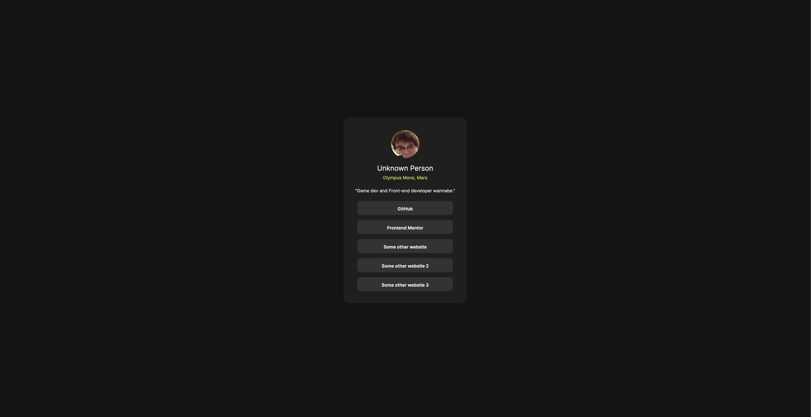
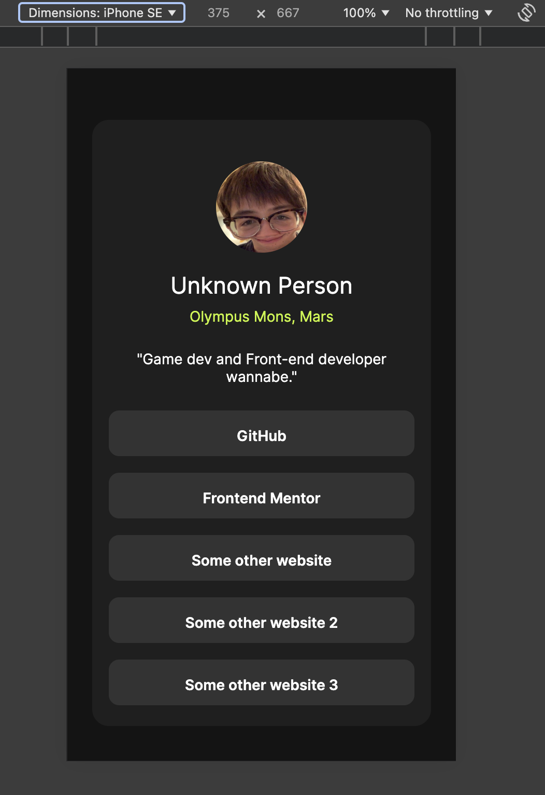

# Frontend Mentor - Social links profile solution

This is a solution to the [Social links profile challenge on Frontend Mentor](https://www.frontendmentor.io/challenges/social-links-profile-UG32l9m6dQ). Frontend Mentor challenges help you improve your coding skills by building realistic projects.

## Table of contents

- [Overview](#overview)
  - [The challenge](#the-challenge)
  - [Screenshot](#screenshot)
  - [Links](#links)
- [My process](#my-process)
  - [Built with](#built-with)
  - [What I learned](#what-i-learned)
  - [Continued development](#continued-development)
  - [Useful resources](#useful-resources)
- [Author](#author)

## Overview

### The challenge

Users should be able to:

- See hover and focus states for all interactive elements on the page

### Screenshot

### Links

- Solution URL: [Vercel](https://project-social-links-rose.vercel.app/)

## My process
I used Krita to research the design and measure the dimensions using the ruler tool, then I converted from px to rem.

### Built with

- Semantic HTML5
- Flexbox

### What I learned

I learned to use Krita when Figma designs are not available.

### Continued development

I want to perfect making cards like this an aligning things properly, relying less on margins.

### Useful resources

- [Krita](https://krita.org/en/) - Free photoshop alternative for figuring out the design when Figma is unavailable.

## Author

- Frontend Mentor - [@yarsvent](https://www.frontendmentor.io/profile/yarsvent)
